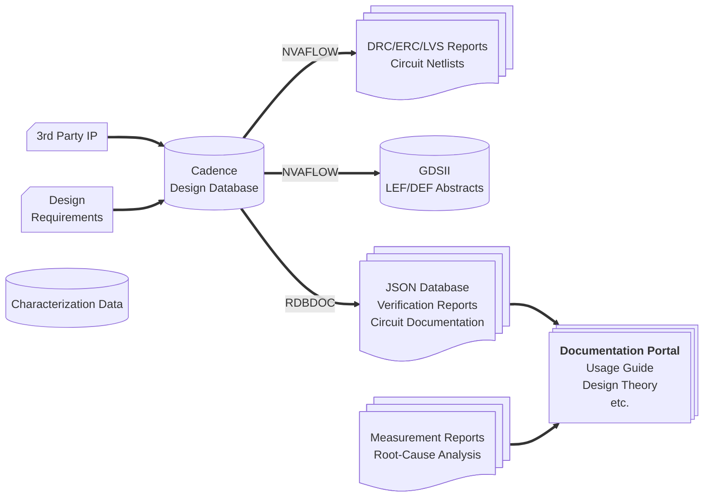

This page briefly discusses aspects for planning and structuring analogue
verification and some of the inherent issues related with coverage. Most of
the examples will reference Cadence design tools which is common place but
alternative with similar flavors exist. This is somewhat specific to analogue
simulation that validates design from a functional point of view. This ties in
with the construction of the test bench that will probe various aspects of the
design to confirm that is operates as expected.

## Design Sign-Off

Sign-off for an analogue design could can imply a multitude of things depending
its dependency. An exhaustive list of delivery items is shown below. Many of
these are only relevant at certain points in the hierarchy but standardizing
the flow for creating each item is essential for systematic design. This
should allow you develop a check-list automated or manual for certain aspects
in each deliverable that ensure quality.

- Specification Table
- Schematic
- Spice Netlist ✔
- Verilog Netlist ✔
- Layout
- GDSII ✔
- DRC Report ✔
- ERC Report ✔
- LVS Report ✔
- LEF Abstract ✔
- Testbench
- Design Documentation
- Verification Report
- Design Review Checklist
- Digital Timing Model
- Test/Trimming Plan

Fortunately many of these items (✔) do not necessarily require manual intervention
and can for the most part be part of a automated flow that sanity-checks
different aspects of the design.

## Design Flow Automation

Several components in the industry analogue design flow are illustrated below
with their relative association. The verification process only touches a small
part in the overall picture but provides key indicators for many other aspects
of the design flow such as project planning, lab work, and software development.



Here I have highlighted two integration tools that automate and assist in
generating various aspects of the design sign-off. Some of which are not user
facing such as GDSII and LVS results which are handled by NVAFLOW and is
closely tied to the process-development-kit (PDK). The other tool is RDBDOC
which assists parsing the cadence database in order to generate and template
reports.

The point here being is that when we sign-off at top-level it is not unusual
for a large number of designs to be incorporated. Each of which should be
checked while it is frozen for external delivery. Such a tool can rigorously
generate all outputs systematically while also performing a series of sanity
checks to grantee design quality.

## Verification Plan

Planning analogue verification in a structured manner is challenging primarily
because one must often carefully consider what is important when simulating a
design. It is very easy to exhaustively simulate without actually gaining
confidence in the design.

Typically one would setup a test bench that checks for both specific
performance metrics such as phase-margin in a amplifier and generic performance
metric such as off-state leakage. Here is it good practice to have a base-line
of checks reflecting best-practices. A few examples of design-agnostic checks:

- Supply sensitivity
- Bias sensitivity
- Nominal current
- Leakage current
- Peak-to-Peak current
- Off-state / grounded controls
- Assertions for illegal states
- Distortion / Linearity
- Calibration/Configuration edge cases
- Debug coverage
- Output/Input impedance

It is important to keep in mind that these metrics are a baseline for evaluating
performance at a distance. One can obviously run a simulation an study the
transient waveform in detail but it is usually not feasible to do this over 500+
simulation points. This is why it is important to derive metrics for performance
that accurately reflect underlying characteristics with one or several numbers
that can be judged over corners and montecarlo.

Now as example a typical verification plan is presented that varies
process parameters in order to expose variations and weakness in the design
such that we have a good expectation of what post-silicon performance
characteristics will look like. This plan is divided into three steps with
increasing simulation effort.

``` markdown
This is a baseline where the designer must recognize the best way to stress
aspects of the design and adjust the plan accordingly.
```

### Simulation Corners

Generally there are three aspect to simulation corner definition:
Front-End-Of-Line (FEOL), Back-End-Of-Line (BEOL), Voltage+Temperature. These
parameters are very closely tied to the process and qualification standard the
circuit aims to achieve. Naturally the more demanding our qualification the harder
it is to guarantee performance over coreners. For example we can target a
temperature range of 0° 70°, -40° 85°, -40° 125° depending if we consider
consumer, industrial, or grade-1 automotive qualification in the JEDEC standard.

We distinguish between FEOL and BEOL because these are two different sets of
process parameters that are affected during fabrication that do not correlate
with one another. FEOL generally relates to device characteristics such as
threshold voltage, off-leakage, transconductance, and current drive while BEOL
relates to interconnect and Metal-Oxide-Metal passives such as capacitors and
inductors. A process will specify bias for FEOL and BEOL while the designer
will specify a bias for temperature and voltage. Together a collection of
parameter biases are grouped as corners and used to simulate circuits under
various post-silicon conditions.

FEOL corners will come in a variety of flavors for different purposes and
should be studied carefully. Analog circuits are generally not that interested
in worst-case leakage corners but a worst-case noise corner maybe available.
Analogue is generally interested in FF and SS extremities, sometimes called
total corners not to be confused with the global corners FFG and SSG, to if
trim ranges and bias ranges are sufficient to meet performance requirements.

Separately we should study BEOL corners. This is usually somewhat easier as the
extremities simply best and worst case capacitance as CWORST/CBEST or best and
worst interconnect time-constants as RCBEST/RCWORST. The designer should know
which set of extremes is worst. Typically low frequency analogue will suffer
most from CWORST/CBEST variation. High freuquency analogue and custom digital
may opt to use the RCWORST/RCBEST corners.

Verification can be planned and separated into three levels of confidence,
each with increasing simulation time. It is always advised to select corners
to find the best and worst case process conditions for our circuit.

### Level 1: Corner Simulations

Level 1 focuses on total corner simulation without montecarlo. The purpose here
is to demonstrate a brief overview of passing performance with DFM checks such
as EMIR and Aging. There maybe some back-and-forth with the layout and design
at this point as verification results are checked.

| **VT Corner** | **High Voltage** | **Nom. Voltage** | **Low Voltage** |
|---------------|------------------|------------------|-----------------|
| **High Temp** | | |FF/SS + CBEST/CWORST|
| **Nom Temp**  | |TT + CBEST/NOM/CWORST| |
| **Low Temp**  |FF/SS + CBEST/CWORST| | |

Total Simulations: 11 + EMIR + Aging

With these preliminary set of results one can pass some judgement over
circuit performance during design review. By including the DFM simulations
here (i.e. EMIR and Aging) the layout will be relatively close to the final
result.

### Level 2: Montecarlo Simulations

Level 2 focuses on presenting a typical distribution of performance metrics
using montecarlo methods. Here we must make an important choice of which mc
corner is used. Generally foundries will recommend to use the global corners:
FFG, SSG, FSG, SFG, and only apply local mismatch. This will yield good
statistical distributions in our testbench metrics and allow use to make
gaussian estimations to limit the number of simulations runs of the same
confidence interval opposed to a unknown distribution. A alternative here is
to use the typical corner and enable both local and global process variation.

| **VT Corner** | **High Voltage** | **Nom. Voltage** | **Low Voltage** |
|---------------|------------------|------------------|-----------------|
| **High Temp** | | |FFG/SSG+CBEST/CWORST|
| **Nom Temp**  | |TT+CNOM| |
| **Low Temp**  |FFG/SSG+CBEST/CWORST| | |

Total Simulations: 225 with 25 mc runs per corner

### Level 3: Completion

Level 3 is intended to be the target set of corners used to validate a design
across corners using montecarlo methods. This is an exhaustive simulation
job and doesn't quite cover all possible scenarios when combining FEOL+BEOL+VT.
Generally however it will a good representation of post-silicon results with a
high quality testbench.

| **VT Corner** | **High Voltage** | **Nom. Voltage** | **Low Voltage** |
|---------------|------------------|------------------|-----------------|
| **High Temp** |FFG/SSG+CBEST/CWORST| |FFG/SSG+CBEST/CWORST|
| **Nom Temp**  | |FFG/TT/FSG/SFG/SSG+CBEST/CNOM/CWORST| |
| **Low Temp**  |FFG/SSG+CBEST/CWORST| |FFG/SSG+CBEST/CWORST|

Total Simulations: 775 + EMIR + Aging with 25 mc runs per corner

This set of results ultimately feeds into the test program for the device.
The distributions can be used to set limits and measurement inferences
when binning and sorting fabricated devices.

## Verification Report

Reporting on our verification results should provide a overview on what the 
circuit targets where, where the senstivities lie, and how non-idialities 
manifest in circuit behavior. Lets discuss a general report structure and 
provide an example.

- Design Files
- Simulator Setup
- Target Specifications
- Simulation Parameters
- Simulation Notes
- Results and Statistical Summary
- Distributions
- EMIR/Aging Results

With a ADE result database from Cadence we can export the data using skill
and generate a generic database file that can be parsed and post-processed by
python. This allows us to make a clean report that need minimal user input
while providing a good overview on simulation results external to the Cadence
environment. A cut-down version of such a report is detailed below. Notice
the designer should still contribute certain annotations to the report such
that it is self explanitory.

> # Verification Summary: MYLIB divider_tb
>   
> lieuwel 2018-01-01
> 
> ## Test Description
> 
> This is a preliminary verification report for the divider circuit
> which is a 8-bit reconfigurable clock divider operating on the RF clock
> after the 4x clock divider from the counter module. This test bench
> is intended to verify correct operation for all divider settings.
> 
> ## Test: Interactive.2:MYLIB_divider_tb_1
>   
> Simulation started on 1st Jan 2018 and ran for 2035 minutes.
> The yield for this test is 100% to 100% (1675 of 1675 points passed)
> Verification state: 1/3
> 
> ### Design Setup
> 
> Library Name: MYLIB
> Cell Name: divider_tb
> View Name: schematic
> Simulator: spectre
> 
> ### Parameters
> 
> |Name|Expression|Values|
> | :---: | :---: | :---: |
> |clk_sr|15p|1.5e-11|
> |clk_pw|clk_pd/2|3.333333e-10|
> |clk_pd|4/6G|6.666667e-10|
> |div|0|0:255|
> |vdd|1.1|1.045, 1.1, 1.155|
> 
> ### Specifications
> 
> |Output|Specification|Pass/Fail|
> | :---: | :---: | :---: |
> |EnergyPerCycle|< 1p|Pass|
> |div_err|-100m - 100m|Pass|
> |div_meas|-|Info|
> |dly_out|< 100p|Pass|
> |fin|1.5G ±1%|Pass|
> 
> ### Output: EnergyPerCycle
>   
> Sample presents a mixed distribution. Using < 1p as specification requirement.
> 
> |Corner|P0.16|P0.5|P0.84|Pass/Fail|
> | :---: | :---: | :---: | :---: | :---: |
> |C_BEST_HTHV|193f|193f, 193f|193f, 193f|Pass|
> |C_BEST_HTLV|168f|168f, 168f|168f, 168f|Pass|
> 
> 
> 
>
> ## Summary
>
> Tests pass with good margin
> 
> EMIR - pass (pre-TO)