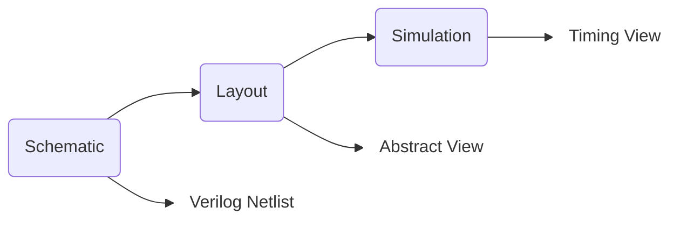

These days it is not usual even for "analogue" chips that we perform digital
integration at the top-level. This is mainly because the digital integration
flow is very well versed in 3rd-party IP integration and providing confidence
in the result assuming well defined constraints. Here I will outline a various
aspects for co-simulation of hard-macro analogue sub-modules in the digital
design flow. Note that in this context full-custom-digital is often also viewed
as analogue as from a integration point-of-view they are effectively equivalent.

## Design Views

As we progress through the analogue design flow, progressively more of the digital
design views can be delivered at each stage. As shown here, first
a functional definition can provided with a behavioral model. This can be in
the form of a verilog netlist where ports are well defined and the underlying
functionality is described using HDL statements. This requires us to discretize
aspects of the design and choose what functionality is implemented
as the end-goal here is digital integration testing.

Subsequently an abstract is generated based on the layout. Naturally
this is used for floor-planning and place & route tools that realize a physical
design. There are some minor nuances here such as pin definition and keep-out
areas that will constrain the digital tools. However the key checks are simple:
are all pins defined and accessible, and is there sufficient clearance to the
boundary to avoid metal spacing violations.

Finally a timing view can be generated depending on how the underlying circuit
is constructed. This process is slightly different when looking at a
circuit where we interface directly with custom digital or transistor level
elements. It is advisable to avoid this specialized part of the flow because
it will require us to resimulate and perform our own characterization of the
timing data using Cadence Liberate. If the digital interface is limited to
standard-cell we can rely on standard-library defined timing-characterization
and the associated digital corners that are used with the rest of the design.

## Innovus Flow

## Liberate Flow